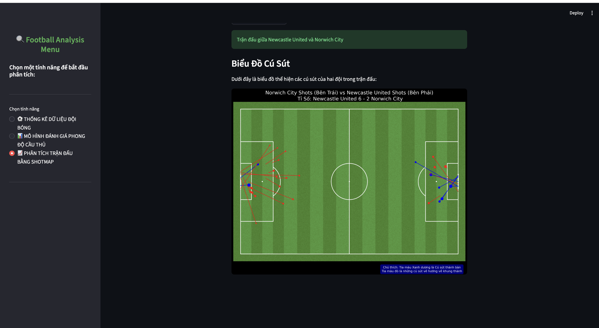
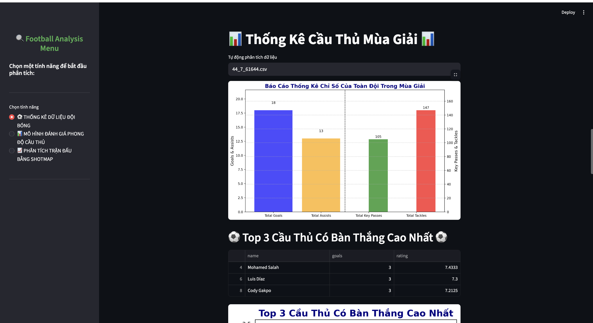

# 📊 Dự án Phân Tích Bóng Đá

## 📖 Tổng Quan
Dự án phân tích bóng đá toàn diện được phát triển bằng Python, sử dụng Streamlit để xây dựng giao diện web tương tác. Dự án bao gồm nhiều module: thống kê đội bóng, đánh giá phong độ cầu thủ và phân tích trận đấu bằng Shotmap.

## 🖼️ Giao Diện

### Trang Chủ


### Tính Năng Phân Tích


## 🎯 Tính Năng Chính

### 1. Thống Kê Đội Bóng
- Thu thập dữ liệu từ API SofaScore
- Phân tích hiệu suất toàn đội
- Hiển thị top cầu thủ (bàn thắng, kiến tạo, tắc bóng,...)
- Biểu đồ trực quan hóa hiệu suất

### 2. Đánh Giá Phong Độ Cầu Thủ
- Phân tích 5 trận gần nhất
- Đánh giá bằng điểm số trung bình
- Biểu đồ: chuyền, bàn thắng, rating,...
- Phân loại vị trí (Tiền đạo, Tiền vệ, Hậu vệ)

### 3. Phân Tích Trận Đấu (Shotmap)
- Dữ liệu từ StatsBomb
- Vẽ shotmap trên sân bóng
- Phân tích cú sút hai đội
- Hiển thị tỉ số và thống kê chi tiết

## 🏗️ Cấu Trúc Dự Án
```
Do_an_1/
├── Data/
├── pic/
│   ├── ảnh1.png
│   └── ảnh2.png
├── Phongdocauthu/
│   ├── Đánh giá cầu thủ 5 trận gần nhất/
│   │   ├── danhgiacauthu.ipynb
│   │   ├── Crawldatacauthu.py
│   │   └── 151545_last5.csv
│   └── Streamlit_danhgia_phongdo_cauthu/
│       └── app2.py
├── Shotmap/
│   ├── Crawl_and_draw_shotmaps 2/
│   └── Streamlit_shotmap/
│       └── main3.py
├── Thongketoandoi/
│   ├── Thống kê toàn đội trong 1 mùa giải_2/
│   │   └── thongke.ipynb
│   └── Streanlit_thongke_toandoi_trongmuagiai/
│       └── app.py
└── Streamlit_final/
    ├── appfinal.py
    └── requirements.txt
```

## 🚀 Cài Đặt & Sử Dụng

### Yêu Cầu
- Python >= 3.8
- Thư viện: `streamlit`, `pandas`, `matplotlib`, `requests`, `statsbombpy`, `mplsoccer`

### Cài Đặt
```bash
pip install -r requirements.txt
```

### Chạy Ứng Dụng
**Tổng hợp (khuyên dùng):**
```bash
streamlit run Streamlit_final/appfinal.py
```
**Chạy từng module:**
```bash
# Đánh giá cầu thủ
streamlit run Phongdocauthu/Streamlit_danhgia_phongdo_cauthu/app2.py

# Thống kê đội bóng
streamlit run Thongketoandoi/Streanlit_thongke_toandoi_trongmuagiai/app.py

# Phân tích Shotmap
streamlit run Shotmap/Streamlit_shotmap/main3.py
```

## 📊 Hướng Dẫn Sử Dụng

### 1. Thống Kê Đội Bóng
- Chọn đội hoặc nhập ID
- Chọn mùa giải và giải đấu
- Bấm "Lấy dữ liệu"
- Xem biểu đồ và top cầu thủ

### 2. Đánh Giá Cầu Thủ
- Nhập ID cầu thủ
- Nhập 5 trận gần nhất
- Tự động crawl dữ liệu và hiển thị biểu đồ, đánh giá

### 3. Phân Tích Shotmap
- Chọn giải đấu, mùa giải từ StatsBomb
- Nhập ID trận đấu
- Xem shotmap tương tác

## 🔧 API & Dữ Liệu

### SofaScore API
- Host: `sofascore.p.rapidapi.com`
- Sử dụng cho: thống kê cầu thủ, đội bóng

### StatsBomb API
- Dùng thư viện `statsbombpy`
- Phân tích Shotmap và Events

## 🎨 Giao Diện & Trực Quan
- Biểu đồ cột, nhiều trục
- Sân bóng trực quan
- Sidebar, banner, nhạc nền
- Responsive cho trình duyệt

## 📝 Tính Năng Nâng Cao
- Tạo CSV tự động
- Xử lý dữ liệu thiếu
- Cảnh báo lỗi chi tiết
- Caching và quản lý trạng thái
- Tối ưu hiệu năng

## 🔮 Kế Hoạch Phát Triển
- Dự đoán kết quả bằng ML
- So sánh cầu thủ khác đội
- Phân tích xu hướng theo mùa
- Tích hợp DB, realtime, đa ngôn ngữ

## 🤝 Đóng Góp
Dự án bởi nhóm Phân Tích Bóng Đá. Mọi đóng góp đều hoan nghênh!

## 📄 Giấy Phép
Dự án phục vụ học tập và nghiên cứu.